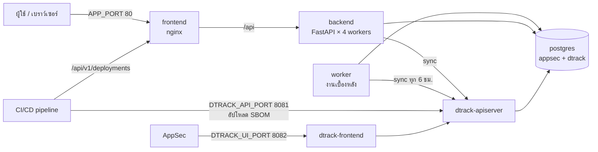

# คู่มือติดตั้งระบบ (Production)

คู่มือนี้ติดตั้ง **AppSec Management Platform** พร้อม **Dependency-Track** แบบเริ่มต้นใหม่ทั้งหมด (clean install) ในเครื่องเดียวด้วย Docker Compose ไม่มีข้อมูลตัวอย่าง มีเพียงผู้ดูแลระบบ 1 คน และนโยบาย Severity/SLA ตั้งต้น

- ไฟล์ติดตั้งทั้งหมดอยู่ที่ [`deploy/production/`](../deploy/production)
- ขั้นตอนการทำงานประจำวันหลังติดตั้ง ดูที่ [workflows.md](workflows.md)
- เหตุผลของกฎการอนุมัติและ SLA ดูที่ [risk-exception-design.md](risk-exception-design.md)

---

## 1. ภาพรวมระบบที่ติดตั้ง



| Container | หน้าที่ | ข้อมูลที่ต้องเก็บถาวร |
| --- | --- | --- |
| `postgres` | ฐานข้อมูล 2 ชุด: `appsec` (แพลตฟอร์ม) และ `dtrack` (Dependency-Track) แยก user กัน | volume `postgres_data` |
| `backend` | API ของแพลตฟอร์ม ตอนเริ่มจะ migrate ฐานข้อมูลและสร้าง admin คนแรกให้อัตโนมัติ | volume `app_uploads` (รายงาน pentest, ไฟล์ SBOM ที่เป็นหลักฐาน) |
| `worker` | งานตามรอบ: sync จาก DT, ตรวจ SBOM ที่ไม่อัปเดต, ตรวจข้อยกเว้นหมดอายุ แยกออกจาก backend เพื่อให้แต่ละงานรันครั้งเดียวต่อรอบ | – |
| `frontend` | หน้าเว็บ และส่งต่อ `/api` ไปที่ backend | – |
| `dtrack-apiserver` | Dependency-Track: วิเคราะห์ SBOM, mirror ฐานข้อมูลช่องโหว่ | volume `dtrack_data` |
| `dtrack-frontend` | หน้าเว็บของ Dependency-Track | – |

## 2. สิ่งที่ต้องเตรียม

### เครื่อง server

| รายการ | ขั้นต่ำ | แนะนำ |
| --- | --- | --- |
| CPU | 4 vCPU | 8 vCPU |
| RAM | 8 GB (Dependency-Track ใช้ราว 4.5–6 GB) | 16 GB |
| Disk | 50 GB | 100 GB SSD (ฐานข้อมูลช่องโหว่ของ DT โตขึ้นเรื่อยๆ) |
| OS | Linux 64-bit ที่รัน Docker ได้ (RHEL 8+/Rocky/Ubuntu 22.04+) | |
| Software | Docker Engine 24+, Docker Compose v2, `python3`, `openssl`, `git` | |

### Network

| ทิศทาง | ปลายทาง | Port | ใช้ทำอะไร |
| --- | --- | --- | --- |
| ผู้ใช้ → server | แพลตฟอร์ม | 80 (หรือ 443 ผ่าน reverse proxy) | หน้าเว็บ |
| AppSec → server | DT UI | 8082 | จัดการ Dependency-Track |
| CI/CD → server | DT API | 8081 | อัปโหลด SBOM |
| CI/CD → server | แพลตฟอร์ม | 80/443 | บันทึก deployment, ตรวจเลขข้อยกเว้น |
| server → internet | `nvd.nist.gov`, `osv-vulnerabilities.storage.googleapis.com`, `api.osv.dev`, `www.cisa.gov`, `api.first.org`, `api.github.com` | 443 | ฐานข้อมูลช่องโหว่, KEV, EPSS |

ถ้า server ออก internet ผ่าน proxy ให้ตั้ง `HTTPS_PROXY` / `HTTP_PROXY` ใน `.env` (ดูข้อ 8)

### DNS

เตรียมชื่อเครื่อง เช่น `appsec.example.org` ที่ผู้ใช้และ CI runner resolve ได้

## 3. ติดตั้ง

### 3.1 แบบมี internet (build จาก source)

```bash
git clone <repository-url> appsec-platform
cd appsec-platform/deploy/production
./scripts/install.sh --host appsec.example.org
```

### 3.2 แบบไม่มี internet (offline bundle)

บนเครื่องที่มี internet และ Docker:

```bash
cd deploy/production
./scripts/build-offline-bundle.sh                         # server x86-64 (ค่าเริ่มต้น)
PLATFORM=linux/arm64 ./scripts/build-offline-bundle.sh    # server ARM
# ได้ไฟล์ dist/appsec-platform-<version>-linux-amd64.tar.gz (ประมาณ 450–500 MB)
```

คัดลอกไฟล์ไปที่ server แล้ว:

```bash
tar xzf appsec-platform-<version>-linux-amd64.tar.gz
cd appsec-platform
./scripts/install.sh --host appsec.example.org --offline
```

> image ต้องตรงกับ CPU ของ server (ตรวจด้วย `uname -m`: `x86_64` = amd64, `aarch64` = arm64) ถ้าสร้าง bundle บน Mac รุ่น Apple Silicon สำหรับ server x86 สคริปต์จะ build แบบ emulation ซึ่งช้ากว่าปกติ
>
> ในโหมด offline Dependency-Track จะยัง mirror ฐานข้อมูลช่องโหว่ไม่ได้จนกว่าจะออก internet ได้ (ผ่าน proxy) — SBOM จะเข้าได้แต่ยังไม่พบช่องโหว่

### 3.3 สิ่งที่ `install.sh` ทำ

1. ตรวจ Docker, Compose, python3, openssl และ RAM
2. สร้าง `.env` จาก `.env.example` ใส่ URL ตาม `--host` และสุ่มรหัสผ่าน/secret ทุกตัว (ไฟล์ mode 600) — ถ้ามี `.env` อยู่แล้วจะใช้ของเดิม ไม่สุ่มใหม่
3. build image (หรือ `docker load` ในโหมด offline)
4. เปิด `postgres`, `backend`, `frontend`, `worker` แล้วรอจน backend พร้อม (backend migrate ฐานข้อมูล + สร้าง admin คนแรก + นโยบายตั้งต้น)
5. เปิด Dependency-Track แล้วรันสคริปต์ `dtrack-bootstrap.py`:
   - เปลี่ยนรหัส `admin/admin` ของ DT เป็นรหัสสุ่ม
   - สร้างทีม "AppSec Platform - Sync (read-only)" และ "AppSec Platform - SBOM Upload" พร้อม API key
   - เปิด OSV mirror (Maven, npm, PyPI, Go, NuGet, crates.io, RubyGems, Packagist)
   - เก็บทุกค่าลง `.env`
6. restart backend/worker ให้อ่าน key ใหม่ และ restart DT ให้เริ่ม mirror

ครั้งแรกใช้เวลาราว 10–20 นาที (ส่วนใหญ่รอ Dependency-Track เริ่มระบบ) รันซ้ำได้อย่างปลอดภัย

### 3.4 ตั้งค่าเองโดยไม่ใช้สคริปต์

```bash
cd deploy/production
cp .env.example .env && chmod 600 .env
# แก้ .env: ใส่ URL และแทน <generate> ทุกตัวด้วยค่าสุ่ม เช่น  openssl rand -base64 36 | tr '+/' '-_'
docker compose up -d --build
python3 scripts/dtrack-bootstrap.py --url http://127.0.0.1:8081 --env-file .env
docker compose up -d backend worker && docker compose restart dtrack-apiserver
```

## 4. ตรวจสอบหลังติดตั้ง

```bash
docker compose ps                        # ทุก service ต้อง Up, backend เป็น (healthy)
curl -s http://appsec.example.org/health # {"status":"ok"}
curl -s http://appsec.example.org:8081/api/version
docker compose logs --tail 20 worker     # เห็น "Background jobs: Dependency-Track sync every 6h ..."
```

เปิด `APP_PUBLIC_URL` แล้ว login ด้วย `INITIAL_ADMIN_USERNAME` และรหัส `INITIAL_ADMIN_PASSWORD` จาก `.env`

## 5. หลังติดตั้ง (ทำตามลำดับ)

| # | ใคร | ทำอะไร | ที่ไหน |
| --- | --- | --- | --- |
| 1 | Admin | เปลี่ยนรหัสผ่าน admin แล้ว **ลบบรรทัด `INITIAL_ADMIN_PASSWORD` ออกจาก `.env`** (ใช้เฉพาะตอนฐานข้อมูลว่าง) | ตั้งค่า → ผู้ใช้ → admin → ตั้งรหัสใหม่ |
| 2 | Admin | สร้างผู้ใช้จริงและกำหนด **ระดับการอนุมัติ** (ดูตารางด้านล่าง) หรือเชื่อม **Entra ID** ให้ผู้ใช้เข้าด้วย Microsoft และได้ role ตามกลุ่ม ([entra-id.md](entra-id.md)) | ตั้งค่า → ผู้ใช้ / Entra ID |
| 3 | Admin | สร้างบัญชี pipeline: role `CI/CD pipeline`, รหัสผ่านยาว, เก็บใน secret store ของ CI | ตั้งค่า → ผู้ใช้ |
| 4 | Admin | ตั้ง ITSM/Jira ถ้าใช้ | ตั้งค่า → การเชื่อมต่อ |
| 5 | AppSec | ตรวจ/ปรับนโยบาย Severity/SLA (ฉบับตั้งต้นคือ version 1) | นโยบาย |
| 6 | AppSec | ใส่ **มาตรการควบคุม** ขององค์กร (WAF, network segmentation, EDR ฯลฯ) พร้อมวันทบทวน | มาตรการควบคุม |
| 7 | AppSec | เข้า DT UI ด้วย `admin` / `DTRACK_ADMIN_PASSWORD` แล้วสร้างบัญชีส่วนตัวแทน | DT UI |
| 8 | DevOps | เพิ่มขั้นตอนใน pipeline ตาม [workflows.md W1 และ W2](workflows.md) โดยใช้ `DEPENDENCY_TRACK_UPLOAD_API_KEY` และบัญชี pipeline | CI/CD |
| 9 | AppSec | เมื่อ SBOM แรกเข้า DT แล้ว กด **SBOM → Sync ทันที** และยืนยันทีมเจ้าของแอป | SBOM, แอปพลิเคชัน |

### ระดับการอนุมัติที่แนะนำ

| ตำแหน่ง | Role | ระดับ | อนุมัติได้ |
| --- | --- | --- | --- |
| AppSec Engineer | AppSec | L1 | ยอมรับความเสี่ยง Low/Medium, FP/NA ที่ไม่ใช่ Critical/KEV |
| AppSec Lead / Security Manager | AppSec | L2 | High, FP/NA ระดับ Critical/KEV, คนแรกของ Critical |
| CISO / ผู้บริหารความเสี่ยง | Management | L3 | คนที่สองของ Critical/KEV และคำขอที่ครอบคลุมหลายแอป |
| Tech Lead / นักพัฒนา | Dev Team | – | เป็นผู้ขอ (Maker) เท่านั้น |

ต้องมี L2 อย่างน้อย 1 คนและ L3 อย่างน้อย 1 คน ไม่เช่นนั้นคำขอระดับ High/Critical จะไม่มีใครอนุมัติได้ Admin อนุมัติข้อยกเว้นไม่ได้โดยออกแบบ

## 6. HTTPS

แนะนำให้ reverse proxy หรือ load balancer ขององค์กรทำ TLS ไว้ด้านหน้า:

1. ตั้งใน `.env`: `APP_BIND=127.0.0.1`, `DTRACK_BIND=127.0.0.1` (ไม่เปิด port ตรงออกนอกเครื่อง)
2. เปลี่ยน URL เป็น `https://...` ทั้ง `APP_PUBLIC_URL`, `DTRACK_UI_PUBLIC_URL`, `DTRACK_API_PUBLIC_URL`
3. ให้ proxy ส่งต่อ: `appsec.example.org` → `127.0.0.1:80`, `dtrack.example.org` → `127.0.0.1:8082`, `dtrack-api.example.org` → `127.0.0.1:8081` และตั้ง body size ≥ 50 MB สำหรับ SBOM ขนาดใหญ่
4. `docker compose up -d` เพื่อให้ค่าใหม่มีผล

ตัวอย่าง nginx บน host:

```nginx
server {
    listen 443 ssl;
    server_name appsec.example.org;
    ssl_certificate     /etc/pki/tls/certs/appsec.crt;
    ssl_certificate_key /etc/pki/tls/private/appsec.key;
    client_max_body_size 50m;
    location / {
        proxy_pass http://127.0.0.1:80;
        proxy_set_header Host $host;
        proxy_set_header X-Forwarded-For $proxy_add_x_forwarded_for;
        proxy_set_header X-Forwarded-Proto https;
    }
}
```

## 7. สำรองและกู้คืนข้อมูล

### สำรอง

```bash
cd deploy/production
./scripts/backup.sh                 # -> backups/<วันเวลา>/
```

ได้ไฟล์ `appsec.dump`, `dtrack.dump`, `uploads.tar.gz`, `dtrack-keys.tar.gz`, `env`, `SHA256SUMS` — โฟลเดอร์นี้มี secret ให้เข้ารหัสก่อนเก็บนอกเครื่อง

ตั้ง cron ทุกคืน เช่น `0 1 * * * cd /opt/appsec-platform/deploy/production && ./scripts/backup.sh >> /var/log/appsec-backup.log 2>&1` และลบของเก่าตามนโยบาย retention

### กู้คืน (เครื่องใหม่หรือหลังเสียหาย)

```bash
cd deploy/production
cp /path/to/backup/env .env && chmod 600 .env
docker compose up -d postgres
docker compose exec -T postgres pg_restore -U appsec -d appsec --clean --if-exists < /path/to/backup/appsec.dump
docker compose exec -T postgres pg_restore -U appsec -d dtrack --clean --if-exists --role=dtrack < /path/to/backup/dtrack.dump
docker compose up -d backend dtrack-apiserver
docker compose exec -T backend tar xzf - -C /app < /path/to/backup/uploads.tar.gz
docker compose exec -T dtrack-apiserver tar xzf - -C /data < /path/to/backup/dtrack-keys.tar.gz
docker compose restart dtrack-apiserver
docker compose up -d
```

ทดสอบกู้คืนบนเครื่องทดสอบอย่างน้อยปีละครั้ง

## 8. การตั้งค่า (`.env`)

| ตัวแปร | ค่าเริ่มต้น | ความหมาย |
| --- | --- | --- |
| `APP_PUBLIC_URL` | – | URL ที่ผู้ใช้เปิด ต้องตรงทุกตัวอักษร (ใช้เป็น CORS origin) |
| `DTRACK_UI_PUBLIC_URL`, `DTRACK_API_PUBLIC_URL` | – | URL ของ DT ที่เบราว์เซอร์/CI เข้าถึง |
| `APP_PORT`, `DTRACK_UI_PORT`, `DTRACK_API_PORT` | 80, 8082, 8081 | port บน host |
| `APP_BIND`, `DTRACK_BIND` | 0.0.0.0 | ตั้ง 127.0.0.1 เมื่อมี reverse proxy บนเครื่อง |
| `POSTGRES_PASSWORD`, `DTRACK_DB_PASSWORD` | สุ่ม | รหัสฐานข้อมูล (DTRACK ใช้ตอนสร้าง volume ครั้งแรกเท่านั้น) |
| `SECRET_KEY` | สุ่ม | กุญแจเซ็น token ถ้าเปลี่ยนทุกคนต้อง login ใหม่ |
| `INITIAL_ADMIN_*` | admin | ใช้ตอนฐานข้อมูลยังไม่มีผู้ใช้เท่านั้น |
| `DEPENDENCY_TRACK_API_KEY` | สคริปต์ใส่ให้ | key อ่านอย่างเดียวสำหรับ sync |
| `DEPENDENCY_TRACK_UPLOAD_API_KEY` | สคริปต์ใส่ให้ | key อัปโหลด SBOM — ให้ CI/CD ใช้ |
| `DTRACK_ADMIN_PASSWORD` | สคริปต์ใส่ให้ | รหัส admin ของ DT UI |
| `APP_VERSION`, `DTRACK_VERSION` | 0.3.0, 4.14.4 | เวอร์ชัน image |
| `IMAGE_PREFIX` | appsec-platform | ชื่อ registry ถ้า push image เข้า registry ขององค์กร |
| `DTRACK_MEMORY_LIMIT` | 6g | RAM สูงสุดของ DT (ห้ามต่ำกว่า 4.5g) |
| `ACCESS_TOKEN_EXPIRE_MINUTES` | 480 | อายุ session |
| `ENTRA_TENANT_ID`, `ENTRA_CLIENT_ID`, `ENTRA_CLIENT_SECRET` | – | เข้าสู่ระบบด้วย Microsoft (ตั้งครบ 3 ตัวถึงเปิด) ดู [entra-id.md](entra-id.md) |
| `ENTRA_JIT_PROVISIONING` | true | สร้างบัญชีตอนเข้าครั้งแรกถ้าตรงการกำหนดบทบาท |
| `SCIM_BEARER_TOKEN` | – | เปิด SCIM provisioning จาก Entra ID |
| `LOCAL_LOGIN_ENABLED` | true | false = รหัสผ่านภายในใช้ได้เฉพาะผู้ดูแลระบบและ CI/CD |
| `SBOM_SYNC_INTERVAL_HOURS` | 6 | รอบ sync จาก DT |
| `STALE_SBOM_DAYS` | 90 | ไม่มี SBOM ใหม่กี่วันถือว่าไม่อัปเดต |
| `EXCEPTION_SWEEP_INTERVAL_HOURS` | 24 | รอบตรวจข้อยกเว้นหมดอายุ/ปิด/ต้องทบทวน |
| `HTTPS_PROXY`, `HTTP_PROXY`, `NO_PROXY` | – | proxy ออก internet |
| `CISA_KEV_FEED_URL`, `EPSS_API_URL`, `OSV_API_URL` | feed สาธารณะ | ตั้งเป็นค่าว่างเพื่อปิด (air-gapped) |

แก้ `.env` แล้วต้อง `docker compose up -d` ให้ container ที่เกี่ยวข้องถูกสร้างใหม่

## 9. อัปเกรดเวอร์ชัน

```bash
cd deploy/production
./scripts/backup.sh                     # สำรองก่อนทุกครั้ง
git pull                                # หรือแตก offline bundle ใหม่ทับ (เก็บ .env เดิมไว้)
# แก้ APP_VERSION ใน .env ให้ตรงเวอร์ชันใหม่
docker compose build                    # offline: gunzip -c images.tar.gz | docker load
docker compose up -d
docker compose logs --tail 30 backend   # ต้องเห็น "Running database migrations..." ไม่มี error
```

backend migrate ฐานข้อมูลเองตอนเริ่ม ถ้ามีปัญหาให้กลับไปใช้ image เวอร์ชันเดิมและกู้ข้อมูลจาก backup (migration บางตัวย้อนกลับได้ไม่สมบูรณ์)

อัปเกรด Dependency-Track: แก้ `DTRACK_VERSION` แล้ว `docker compose pull dtrack-apiserver dtrack-frontend && docker compose up -d` — อ่าน release notes ของ DT ก่อน

## 10. แก้ปัญหา

| อาการ | สาเหตุที่พบบ่อย | วิธีแก้ |
| --- | --- | --- |
| backend ไม่ healthy, log มี `Bootstrap failed` | ฐานข้อมูลว่างแต่ไม่มี/สั้นเกิน `INITIAL_ADMIN_PASSWORD` | ใส่รหัสอย่างน้อย 12 ตัวอักษรใน `.env` แล้ว `docker compose up -d backend` |
| backend ไม่ healthy, log มี `password authentication failed` | เปลี่ยน `POSTGRES_PASSWORD` หลังสร้าง volume แล้ว | ใช้รหัสเดิม หรือเปลี่ยนรหัสในฐานข้อมูลด้วย `ALTER ROLE` |
| login แล้วเด้งกลับ / CORS error | `APP_PUBLIC_URL` ไม่ตรงกับ URL ที่เปิดจริง | แก้ให้ตรง (รวม http/https และ port) แล้ว `docker compose up -d` |
| `dtrack-apiserver` restart วน, log มี `OutOfMemoryError` หรือ exit 137 | RAM ไม่พอ | เพิ่ม RAM ให้เครื่อง หรือ `DTRACK_MEMORY_LIMIT` |
| หน้า DT UI ขึ้นแต่ login ไม่ได้ / network error | `DTRACK_API_PUBLIC_URL` ไม่ใช่ URL ที่เบราว์เซอร์เข้าถึงได้ | แก้แล้ว `docker compose up -d dtrack-frontend` |
| SBOM เข้า DT แล้วแต่ไม่พบช่องโหว่ | DT ยัง mirror ไม่เสร็จ หรือออก internet ไม่ได้ | ดู DT UI → Administration → Vulnerability Sources, ตรวจ proxy |
| Sync แล้วแอปไม่ขึ้นในแพลตฟอร์ม | key ไม่ถูก หรือ backend ยังไม่ได้ restart หลังได้ key | ดู `docker compose logs worker`, รัน `docker compose up -d backend worker` |
| ข้อยกเว้นไม่หมดอายุตามกำหนด | worker ไม่ทำงาน | `docker compose ps worker`, `docker compose logs worker` |

ดู log: `docker compose logs -f <service>` · ดูทรัพยากร: `docker stats`

## 11. Checklist ความปลอดภัยก่อนเปิดใช้งาน

- [ ] ใช้ HTTPS และปิด port 80/8081/8082 ตรงจากภายนอก (ข้อ 6)
- [ ] เปลี่ยนรหัส admin และลบ `INITIAL_ADMIN_PASSWORD` ออกจาก `.env`
- [ ] `.env` เป็น mode 600 และเจ้าของคือ root/ผู้ดูแลเท่านั้น
- [ ] สร้างบัญชี DT ส่วนตัวแทนการใช้ `admin` ร่วมกัน
- [ ] เก็บ `DEPENDENCY_TRACK_UPLOAD_API_KEY` และรหัสบัญชี pipeline ใน secret store ของ CI เท่านั้น
- [ ] ตั้ง backup รายวันและทดสอบกู้คืนแล้ว
- [ ] มีผู้อนุมัติ L2 และ L3 อย่างน้อยระดับละ 1 คน
- [ ] ตั้ง firewall ให้ port 5432 ของ postgres ไม่เปิดออกนอกเครื่อง (ค่าเริ่มต้นไม่ได้เปิดอยู่แล้ว)
