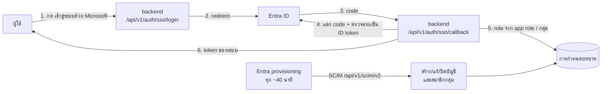

# เชื่อมต่อ Microsoft Entra ID (SSO + SCIM)

ให้พนักงานเข้าสู่ระบบด้วยบัญชี Microsoft ของบริษัท และได้บทบาท (role) ตาม **กลุ่ม** หรือ **app role** ใน Entra ID โดยไม่ต้องสร้างผู้ใช้หรือกำหนด role ในระบบทีละคน

- **เข้าสู่ระบบ:** OpenID Connect (OAuth 2.0 authorization code + PKCE) ผ่าน backend ซึ่งถือ client secret เอง
- **สร้าง/ปิดบัญชีอัตโนมัติ:** SCIM 2.0 จากหน้า Provisioning ของ Enterprise application (ไม่บังคับ แต่แนะนำ)
- **กำหนดบทบาท:** ตั้งในระบบที่ ตั้งค่า › Entra ID › การกำหนดบทบาท ว่ากลุ่มหรือ app role ไหนได้ role อะไร

> SAML 2.0 ยังไม่รองรับ ถ้าใช้ Entra ID ไม่จำเป็นต้องใช้ SAML เพราะ OIDC ให้ข้อมูลเดียวกัน (ผู้ใช้, กลุ่ม, app role) และไม่ต้องติดตั้ง library ที่พึ่ง xmlsec เพิ่มในเครื่อง server

---

## 1. ภาพรวม



**ใช้แบบไหนดี**

| แบบ | สิ่งที่ได้ | ข้อจำกัด |
| --- | --- | --- |
| **SSO + SCIM (แนะนำ)** | บัญชีถูกสร้างก่อนผู้ใช้เข้าครั้งแรก, ย้ายกลุ่มหรือปิดบัญชีใน Entra แล้วสิทธิ์ในระบบเปลี่ยนตามในรอบ sync ถัดไป (ประมาณ 40 นาที) แม้ผู้ใช้จะยังเปิดหน้าจออยู่ | ต้องตั้งค่า Provisioning เพิ่ม |
| SSO อย่างเดียว | ตั้งค่าน้อยที่สุด บัญชีถูกสร้างตอนเข้าครั้งแรก (`ENTRA_JIT_PROVISIONING=true`) | สิทธิ์อัปเดตเฉพาะตอนผู้ใช้ **เข้าสู่ระบบใหม่** คนที่ถูกเอาออกจากกลุ่มยังใช้ session เดิมได้จนหมดอายุ (`ACCESS_TOKEN_EXPIRE_MINUTES`, ค่าตั้งต้น 8 ชม.) |

---

## 2. ลงทะเบียนแอปใน Entra ID (App registration)

ทำใน [Entra admin center](https://entra.microsoft.com) ด้วยสิทธิ์ Application Administrator ขึ้นไป

1. **Identity › Applications › App registrations › New registration**
   - Name: `AppSec Management Platform`
   - Supported account types: *Accounts in this organizational directory only (Single tenant)*
   - Redirect URI: เลือก **Web** แล้วใส่ `https://<APP_PUBLIC_URL>/api/v1/auth/sso/callback`
     (คัดลอกค่าจริงได้จากหน้า ตั้งค่า › Entra ID ในระบบ)
2. หน้า **Overview**: จด **Application (client) ID** และ **Directory (tenant) ID** (ทั้งคู่เป็น GUID)
3. **Certificates & secrets › New client secret**: จดค่า *Value* ทันที (จะแสดงครั้งเดียว) และตั้งเตือนตัวเองก่อนวันหมดอายุ
4. **App roles › Create app role** (Allowed member types: *Users/Groups*) ตัวอย่างที่แนะนำ:

   | Display name | Value | ใช้กับ role ในระบบ |
   | --- | --- | --- |
   | Platform Admin | `Platform.Admin` | ผู้ดูแลระบบ |
   | AppSec Analyst | `AppSec.Analyst` | AppSec, ระดับอนุมัติ L1 |
   | AppSec Lead | `AppSec.Lead` | AppSec, ระดับอนุมัติ L2 |
   | Risk Executive | `Risk.Executive` | ผู้บริหาร, ระดับอนุมัติ L3 |
   | Management Viewer | `Management.Viewer` | ผู้บริหาร (ดูอย่างเดียว) |
   | Audit Viewer | `Audit.Viewer` | Audit |
   | Legal Officer | `Legal.Officer` | Legal |

   ทีมพัฒนาแต่ละทีมไม่ต้องสร้าง app role ใช้ **กลุ่ม** แทน (ข้อ 6)
5. **Token configuration › Add groups claim** (ถ้าจะใช้กลุ่มกำหนด role)
   - เลือก **Groups assigned to the application** เพื่อให้ token มีเฉพาะกลุ่มที่เกี่ยวข้อง ถ้าเลือก *Security groups* แล้วผู้ใช้อยู่เกิน 200 กลุ่ม token จะส่งรายชื่อกลุ่มมาไม่ได้ (group overage) ระบบจะใช้กลุ่มจาก SCIM แทน
   - ID token: เลือก **Group ID**
6. **Enterprise applications › AppSec Management Platform**
   - **Properties › Assignment required?** = **Yes** (คนที่ไม่ได้ assign เข้าแอปจะเข้าไม่ได้ตั้งแต่ฝั่ง Microsoft)
   - **Users and groups › Add user/group**: assign กลุ่มให้ app role ตามตารางข้อ 4 และ assign กลุ่มทีมพัฒนา (role *Default Access* หรือ *User*)

## 3. ตั้งค่า server

เพิ่มใน `deploy/production/.env` แล้ว `docker compose up -d` ใหม่

```bash
ENTRA_TENANT_ID=<Directory (tenant) ID>
ENTRA_CLIENT_ID=<Application (client) ID>
ENTRA_CLIENT_SECRET=<client secret value>
# สร้างบัญชีตอนเข้าครั้งแรกถ้าตรงกับการกำหนดบทบาท (false = ต้องให้ SCIM สร้างก่อน)
ENTRA_JIT_PROVISIONING=true
# เปิด SCIM (ข้อ 4): ค่าสุ่มยาว ๆ ใส่ค่าเดียวกันในหน้า Provisioning
SCIM_BEARER_TOKEN=$(openssl rand -hex 32)
```

- `APP_PUBLIC_URL` ต้องตรงกับที่ผู้ใช้เปิด และต้องเป็น **https** ใน production (Entra ไม่รับ redirect URI แบบ http ยกเว้น localhost)
- ค่าลับทั้งหมดอยู่ใน `.env` เท่านั้น หน้าจอในระบบไม่แสดงและแก้ไม่ได้
- ตรวจ: เปิดหน้า login จะเห็นปุ่ม **เข้าสู่ระบบด้วย Microsoft** และหน้า ตั้งค่า › Entra ID จะแสดง "เปิดอยู่"

## 4. เปิด SCIM provisioning (แนะนำ)

Enterprise applications › AppSec Management Platform › **Provisioning**

1. Provisioning Mode: **Automatic**
2. Admin Credentials
   - Tenant URL: `https://<APP_PUBLIC_URL>/api/v1/scim/v2` (คัดลอกจากหน้า ตั้งค่า › Entra ID)
   - Secret Token: ค่า `SCIM_BEARER_TOKEN`
   - กด **Test Connection** ต้องขึ้นว่าสำเร็จ
3. Mappings
   - **Provision Microsoft Entra ID Groups**: เปิด และคง mapping `objectId → externalId` ไว้ตามค่าตั้งต้น (ระบบใช้ object ID ของกลุ่มเป็นตัวจับคู่ ตรงกับค่าใน token)
   - **Provision Microsoft Entra ID Users**: ค่าตั้งต้นใช้ได้ (`userPrincipalName → userName`) ถ้าจะใช้ app role ผ่าน SCIM ด้วย ให้เพิ่ม mapping
     - Mapping type: *Expression*, Expression: `AppRoleAssignmentsComplex([appRoleAssignments])`, Target attribute: `roles`
4. Settings › Scope: **Sync only assigned users and groups**
5. Provisioning Status: **On** แล้ว Save รอบแรกอาจใช้เวลาหลายนาที ดูผลที่ *Provisioning logs*

สิ่งที่ SCIM ทำในระบบ

- สร้างบัญชีแบบ Entra ID (ไม่มีรหัสผ่านภายใน) และแก้ชื่อ/อีเมลตาม Entra
- ผู้ใช้ถูกปิด (disable) หรือถูกลบใน Entra → บัญชีในระบบถูกปิด **ไม่ลบ** เพราะประวัติการอนุมัติและ Audit Trail อ้างถึงชื่อบัญชี
- สมาชิกกลุ่มเปลี่ยน → คำนวณ role ใหม่ทันที และบันทึกใน Audit Trail (`user.directory_access`)
- SCIM มองไม่เห็นและแก้ไม่ได้กับ **บัญชีภายใน** (ผู้ดูแลระบบ, CI/CD) เสมอ

## 5. กำหนดบทบาทในระบบ

ตั้งค่า › **Entra ID** › การกำหนดบทบาท › **เพิ่มการกำหนดบทบาท**

| ให้สิทธิ์จาก | ค่า | บทบาท | ระดับอนุมัติ | ทีมเจ้าของ |
| --- | --- | --- | --- | --- |
| App role | `Platform.Admin` | ผู้ดูแลระบบ | – | – |
| App role | `AppSec.Analyst` | AppSec | L1 | – |
| App role | `AppSec.Lead` | AppSec | L2 | – |
| App role | `Risk.Executive` | ผู้บริหาร | L3 | – |
| App role | `Audit.Viewer` | Audit | – | – |
| กลุ่ม | object ID ของ `SG-AppSec-Dev-Alpha` | ทีมพัฒนา | – | Team Alpha |
| กลุ่ม | object ID ของ `SG-AppSec-Dev-Beta` | ทีมพัฒนา | – | Team Beta |

- ถ้า SCIM ส่งกลุ่มมาแล้ว เลือกจากรายการได้เลย ถ้ายังไม่ส่ง ใส่ object ID (Entra › Groups › เลือกกลุ่ม › Object ID)
- ชื่อ **ทีมเจ้าของ** ต้องตรงกับ Owner team ของแอปพลิเคชันในระบบ ทีมพัฒนาเห็นเฉพาะแอปของทีมตัวเอง
- บันทึกแล้วระบบคำนวณ role ของทุกบัญชี Entra ใหม่ทันที และบอกว่ามีกี่คนที่เปลี่ยน

**ระบบตัดสิน role อย่างไร** (หนึ่งบัญชีมีได้หนึ่ง role)

1. รวมทุกแถวที่ตรงกับ app role หรือกลุ่มของผู้ใช้ (ไม่สนตัวพิมพ์เล็ก/ใหญ่)
2. เลือก role ที่กว้างที่สุด: ผู้ดูแลระบบ › AppSec › ผู้บริหาร › Audit › Legal › ทีมพัฒนา
3. ระดับอนุมัติ = สูงสุดในบรรดาแถวของ role ที่ชนะ (มีได้เฉพาะ AppSec และผู้บริหาร)
4. ทีมพัฒนาที่อยู่หลายทีม: ใช้ทีมแรกตามตัวอักษร (ควรให้แต่ละคนอยู่ทีมเดียว)
5. ไม่ตรงแถวไหนเลย → **เข้าระบบไม่ได้** (หน้า login บอกให้ติดต่อผู้ดูแล) และบัญชีที่มีอยู่แล้วถูกตัดสิทธิ์ทันที
6. role *CI/CD pipeline* มาจาก Entra ไม่ได้ ใช้บัญชีภายในเท่านั้น

## 6. บัญชีภายในและ break-glass

- บัญชีที่สร้างในหน้า ผู้ใช้งาน ยังใช้รหัสผ่านได้ตามเดิม บัญชีจาก Entra ใช้รหัสผ่านภายในไม่ได้ และแก้ role ในหน้าผู้ใช้ไม่ได้ (แก้ที่ Entra) ผู้ดูแลกด **ปิดใช้งานบัญชี** ได้เป็นการล็อกฉุกเฉิน แต่รอบ SCIM ถัดไปอาจเปิดกลับ ให้ปิดใน Entra ด้วย
- เมื่อทุกคนย้ายมาใช้ Microsoft แล้ว ตั้ง `LOCAL_LOGIN_ENABLED=false` จะเหลือแค่ **ผู้ดูแลระบบ** (ไว้เข้ากรณี Entra ใช้ไม่ได้) และ **บัญชี CI/CD** ที่ใช้รหัสผ่านได้
- เก็บรหัสผ่านผู้ดูแลระบบภายในไว้ในที่ปลอดภัย (เช่น ตู้เซฟ/Password vault) และทดสอบเข้าอย่างน้อยไตรมาสละครั้ง
- ระบบไม่ผูกบัญชีภายในกับบัญชี Microsoft ที่ชื่อหรืออีเมลซ้ำกันให้อัตโนมัติ (ป้องกันการยึดบัญชี) ถ้าจะย้ายคนเดิมมาใช้ Microsoft ให้แก้อีเมลของบัญชีภายในเดิมเป็นค่าอื่นแล้วปิดใช้งาน ประวัติเก่ายังอยู่กับบัญชีเดิม ส่วนชื่อผู้ใช้ภายใน (เช่น `dev.alpha`) ไม่ชนกับ UPN (`name@company.com`) อยู่แล้ว

## 7. แก้ปัญหา

| หน้า login แสดง | สาเหตุ | แก้ |
| --- | --- | --- |
| ยังไม่ได้รับสิทธิ์ใช้ระบบนี้ | กลุ่ม/app role ของผู้ใช้ไม่ตรงกับการกำหนดบทบาทใด | ตรวจว่าผู้ใช้อยู่ในกลุ่มที่ assign ให้แอป และมีแถวในหน้า Entra ID; ดูกลุ่มที่ระบบเห็นในหน้า ผู้ใช้งาน › เลือกคน |
| มีบัญชีภายในที่ใช้ชื่อหรืออีเมลนี้อยู่แล้ว | มีบัญชีภายในที่ username/อีเมลเดียวกับ UPN | ดูข้อ 6 |
| Entra ID ยังไม่ได้สร้างบัญชีของคุณ | `ENTRA_JIT_PROVISIONING=false` และ SCIM ยังไม่ sync คนนี้ | รอรอบ sync หรือกด *Provision on demand* |
| บัญชีนี้ถูกปิดใช้งาน | ปิดในระบบหรือใน Entra | เปิดใน Entra (SCIM) หรือในหน้าผู้ใช้ |
| เข้าสู่ระบบด้วย Microsoft ไม่สำเร็จ | ค่าใน `.env` ผิด, secret หมดอายุ, redirect URI ไม่ตรง, เวลา server ไม่ตรง | ดู `docker compose logs backend` หา `Entra sign-in failed` ข้อความจาก Microsoft (เช่น `AADSTS7000215` = secret ผิด, `AADSTS50011` = redirect URI ไม่ตรง) |
| หน้า Microsoft ขึ้น AADSTS50105 | ผู้ใช้ไม่ได้ถูก assign เข้าแอป (Assignment required = Yes) | assign ผู้ใช้หรือกลุ่มใน Enterprise application |
| SCIM Test Connection ไม่ผ่าน | URL ผิด, token ไม่ตรง, server ไม่ได้เปิดให้ Microsoft เข้าถึงจาก internet | SCIM ต้องรับ request จาก Microsoft cloud ได้ ถ้า server อยู่ในวงใน ให้เปิดเฉพาะ path `/api/v1/scim/` ผ่าน reverse proxy หรือใช้ Entra provisioning agent |

## 8. หมายเหตุด้านความปลอดภัย

- backend ตรวจลายเซ็น ID token กับ key ของ tenant, ตรวจ audience, issuer, tenant, วันหมดอายุ, `nonce` และ `state` (ป้องกัน CSRF และ replay) และใช้ PKCE
- token ของระบบส่งกลับหน้าเว็บทาง URL fragment (`#token=`) ซึ่งเบราว์เซอร์ไม่ส่งให้ server และไม่ติด log แล้วหน้าเว็บลบออกจาก address bar ทันที
- ทุก request ตรวจ role จากฐานข้อมูล ไม่ใช่จาก token ดังนั้นเมื่อ SCIM หรือการกำหนดบทบาทตัดสิทธิ์ ผลมีทันที
- SCIM token เทียบแบบ constant-time; เปลี่ยน token ได้โดยแก้ `.env` แล้วใส่ค่าใหม่ในหน้า Provisioning
- การเปลี่ยน role ทุกครั้ง (จาก SCIM, การเข้าสู่ระบบ หรือแก้การกำหนดบทบาท) บันทึกใน Audit Trail พร้อมแถวที่ทำให้ได้สิทธิ์
