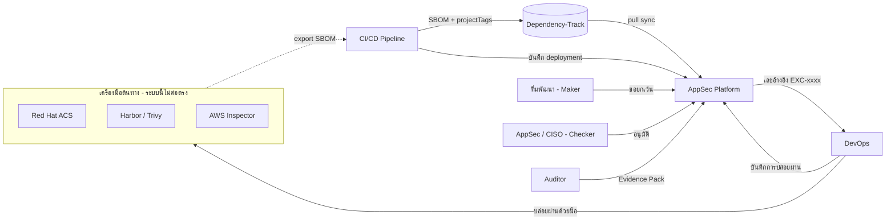
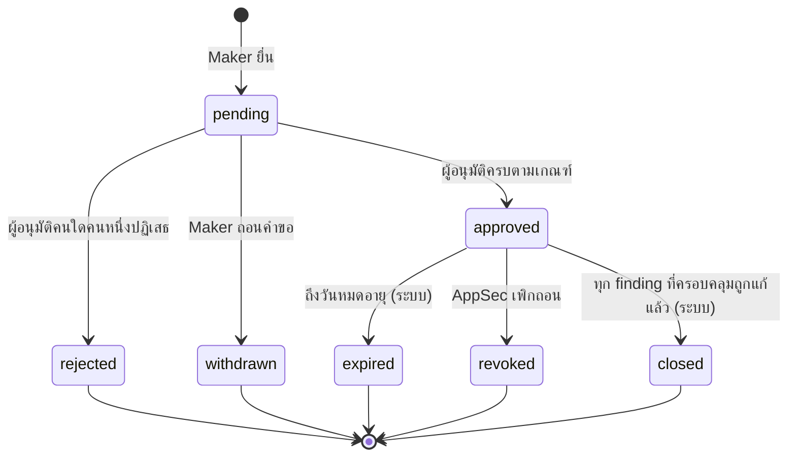

# Risk Exception Register, SLA และ Version Evidence — วิเคราะห์และออกแบบ

สถานะเอกสาร: ใช้เป็นฐานการพัฒนา (ดูสถานะแต่ละ phase ที่หัวข้อ 7)
เอกสารคู่กัน: [workflows.md](workflows.md) — ขั้นตอนการทำงานของแต่ละบทบาท

---

## 1. บทบาทของระบบ

ระบบนี้ **ไม่ใช่** Go-Live Gate การบล็อกเกิดที่เครื่องมือต้นทาง และ DevOps เป็นผู้ปล่อยผ่านด้วยมือ
ระบบนี้เป็น **ศูนย์กลางการตัดสินใจด้านความเสี่ยง** ที่:

1. รับผลสแกนแบบเดียวกันทุกเครื่องมือ — ทุกเครื่องมือออก SBOM แล้ว pipeline ส่งเข้า Dependency-Track (DT)
2. นับ SLA ของช่องโหว่ต่อแอปพลิเคชันอย่างต่อเนื่อง ไม่รีเซ็ตเมื่อ build ใหม่
3. บันทึกคำขอยกเว้น (Exception) พร้อมการประเมินความเสี่ยงด้วย control ขององค์กร
4. บังคับให้ทุกการตัดสินใจผ่าน **Maker–Checker (Four-eye)**
5. ออกเลขอ้างอิงให้ DevOps ใช้เป็นหลักฐานก่อนปล่อยผ่าน และบันทึกการปล่อยผ่าน
6. จับคู่เวอร์ชันที่ใช้งานจริงกับผลสแกนได้ย้อนหลัง เพื่อตอบ Audit

### ขอบเขต

| อยู่ในขอบเขต | ไม่อยู่ในขอบเขต |
|---|---|
| ช่องโหว่ของ package/library ที่มาทาง SBOM → DT | การเชื่อมต่อ/แก้ไขข้อยกเว้นในเครื่องมือต้นทาง (RHACS, Harbor, Inspector) |
| SAST ระดับ code — AppSec บันทึกด้วยมือเฉพาะกรณีที่ถูกบล็อก | ตัวนำเข้าผล AWS Inspector แบบเฉพาะ |
| Exception + Maker–Checker + Residual Severity | การบังคับ Go-Live ในระบบนี้ (หน้า Go-Live Gate เหลือไว้เป็นข้อมูลอ้างอิง) |
| Deployment tracking + Evidence Pack | Export เป็น PDF (รอบแรกเป็น JSON) |

> ข้อจำกัดที่ต้องรู้: SBOM บรรจุได้เฉพาะรายชื่อ component ช่องโหว่ใน code ที่ทีมเขียนเอง
> (Inspector `CODE_VULNERABILITY`) จะไม่เข้ามาทาง DT ต้องบันทึกด้วยมือ

---

## 2. ปัญหาที่พบในระบบปัจจุบัน (ตรวจจากโค้ด)

| # | ปัญหา | หลักฐานในโค้ด | ผลกระทบ |
|---|---|---|---|
| G1 | **วันครบกำหนดเลื่อนทุกครั้งที่ sync** — finding ที่มีอยู่ถูกคำนวณ due date ใหม่จาก "วันนี้" | `sbom/service.py` `_upsert_findings` ใช้ `detected_on = today` ตอนอัปเดต | ช่องโหว่จาก SBOM **ไม่มีวันเกิน SLA** ตัวเลข SLA compliance ไม่จริง |
| G2 | SLA รีเซ็ตทุกเวอร์ชัน — finding ผูกกับเวอร์ชัน ช่องโหว่เดิมในเวอร์ชันใหม่ได้วันเริ่มนับใหม่ | `Finding.app_version_id`, `first_detected_at = now()` | ส่ง build ใหม่ = ได้เวลาแก้เพิ่ม |
| G3 | Backlog นับทุกเวอร์ชันที่เคยสแกน | `_scoped_finding_query` ไม่กรองเวอร์ชัน | CI สร้างเวอร์ชันทุก build → ตัวเลขบวม เวอร์ชันเก่าค้างเปิดตลอด |
| G4 | Waiver: คนเดียวขอและอนุมัติเองได้ | `waivers/service.approve_waiver` ไม่ตรวจผู้ขอ ≠ ผู้อนุมัติ, AppSec อยู่ทั้ง `_REQUESTERS` และ `_APPROVERS` | ไม่มี Four-eye |
| G5 | เปลี่ยน VEX เป็น `not_affected` แล้วซ่อน finding ทันทีโดยคนเดียว | `findings/service.update_vex_status` | ตัด False positive โดยไม่มีผู้ตรวจ |
| G6 | Global suppression ทุกแอปด้วยคนเดียว | `global_suppress_vex` | ความเสี่ยงสูงสุด ไม่มีผู้ตรวจ |
| G7 | Waiver ไม่ประเมินความเสี่ยงใหม่ — แค่เปลี่ยนสถานะ | `approve_waiver` | Severity/SLA ไม่สะท้อน control ที่มี |
| G8 | Waiver ผูกกับ finding รายเวอร์ชัน | `Waiver.finding_id` | build ใหม่ต้องขอยกเว้นใหม่ทุกครั้ง |
| G9 | ไม่มีข้อมูล deployment / digest / commit ที่เชื่อถือได้ | `AppVersion.commit_sha` ไม่เคยถูกเติม, ไม่มีตาราง deployment | ตอบ Audit ไม่ได้ว่าวันที่ X ใช้เวอร์ชันไหน |
| G10 | ไม่มี snapshot ว่าการสแกนแต่ละครั้งเจออะไร | `ScanResult` ไม่เชื่อมกับ finding | ย้อนดูผลสแกน ณ วันนั้นไม่ได้ |

ข้อจำกัดของ DT ที่ทดสอบแล้ว (DT 4.14.4):
- DT **ตัด** `metadata.properties` ของ SBOM ทิ้ง → ส่ง commit/digest ผ่าน SBOM ไม่ได้
- DT **เก็บ** `projectTags` ที่ส่งมาตอนอัปโหลด และ key อ่านอย่างเดียวอ่านได้ → ใช้ tag แทน
- DT ให้ `lastBomImport` ต่อโปรเจกต์ → รู้ว่ามี SBOM ใหม่เข้ามาเมื่อไหร่

---

## 3. การออกแบบข้อมูล

### 3.1 เลือกแนวทาง: Issue Key บน finding เดิม (ไม่ย้าย finding ไประดับแอป)

พิจารณาสองแนวทาง:

| | A. ย้าย Finding ไประดับแอป + ตาราง Occurrence | **B. คง Finding ต่อเวอร์ชัน + เพิ่ม Issue Key ระดับแอป (เลือก)** |
|---|---|---|
| SLA ต่อเนื่องข้ามเวอร์ชัน | ได้ | ได้ — สืบทอดวันเริ่มนับจาก finding ที่ key เดียวกัน |
| Exception ครอบคลุมเวอร์ชันใหม่ | ได้ | ได้ — Exception ผูกกับ (แอป, issue key) |
| ตอบว่าเวอร์ชันไหนมีช่องโหว่อะไร | ได้ | ได้ — แต่ละแถวคือการพบในเวอร์ชันนั้นอยู่แล้ว |
| ผลกระทบกับโค้ด | เขียนใหม่ ~80 จุดใน 12 module + test ส่วนใหญ่ + API/หน้าจอทั้งหมด | เพิ่ม column และ logic ในจุดที่จำเป็น API เดิมยังใช้ได้ |
| ข้อเสีย | ความเสี่ยงสูง ใช้เวลานาน | ช่องโหว่เดียวกันใน 2 เวอร์ชันที่ใช้งานอยู่แสดง 2 แถว (แก้ด้วยการนับแบบ distinct ใน summary) |

**Issue Key** — ตัวตนของช่องโหว่ในระดับแอป

| แหล่ง | Issue key |
|---|---|
| SBOM | `sbom:<ชื่อ component>:<CVE หรือ advisory id>` (ไม่รวมเวอร์ชัน component) |
| SAST (บันทึกมือ) | `sast:<CVE หรือ ชื่อ>` หรือค่าที่ผู้บันทึกระบุ (เช่น rule + ไฟล์) |
| Pentest | `pentest:<pentest project>:<ชื่อ>` |

### 3.2 กติกา SLA

- เพิ่ม `sla_started_on` (วันที่) แยกจาก `first_detected_at` (เวลาที่แถวนี้ถูกสร้าง)
- **วันครบกำหนด = `sla_started_on` + วันตาม SLA ของ severity ที่มีผล** ไม่คำนวณจาก "วันนี้" อีก (แก้ G1)
- finding ใหม่ในแอปที่มี issue key เดียวกันซึ่ง**ยังไม่ถูกแก้** อยู่แล้ว → สืบทอด `sla_started_on` ที่เก่าที่สุด (แก้ G2)
- ถ้าทุกแถวของ key นั้นเคยแก้แล้ว (FIXED) แล้วกลับมาใหม่ → ถือเป็นการกลับมาของช่องโหว่ เริ่มนับใหม่ และบันทึก audit
- Severity ที่มีผล = **Residual Severity** ถ้ามี Exception ที่อนุมัติแล้ว มิฉะนั้นใช้ **Original Severity** จากนโยบาย
- Exception หมดอายุ/ถูกเพิกถอน → กลับไปใช้ Original Severity และคำนวณวันครบกำหนดใหม่จากวันเริ่มนับเดิม (มักเกินกำหนดทันที — ตั้งใจ)

### 3.3 เวอร์ชันที่ใช้งานอยู่ (Active Version) และ Deployment

ตารางใหม่ `deployments`: แอป, เวอร์ชัน, environment, `deployed_at`, `ended_at`, image digest, ผู้บันทึก, แหล่ง (`pipeline`/`manual`), ลิงก์ pipeline

กติกา:
- บันทึก deployment ใหม่ใน environment เดิมของแอปเดิม → ปิด deployment ก่อนหน้าใน environment นั้นอัตโนมัติ
- `AppVersion.is_active` = มี deployment ที่ยังไม่ปิดอย่างน้อยหนึ่งรายการ
- แอปที่ **ไม่เคยมีข้อมูล deployment เลย** → เวอร์ชันที่ ingest ล่าสุดถือเป็น active (เพื่อให้ใช้งานได้ตั้งแต่วันแรก)
- Backlog, Dashboard, SLA compliance นับเฉพาะ finding ของเวอร์ชันที่ active และนับแบบ distinct (แอป, issue key) (แก้ G3)
- เวอร์ชันที่ไม่ active ยังเปิดดูได้ (กรองตามเวอร์ชัน) เพื่อ audit

ช่องทางบันทึก deployment: ขั้น deploy ของ pipeline เรียก API (ผู้ใช้บทบาทใหม่ `pipeline` ที่ทำได้แค่นี้) หรือ DevOps บันทึกผ่านหน้าจอ

### 3.4 Risk Exception (แทน Waiver เดิม)

**ประเภท**

| ประเภท | ผลเมื่ออนุมัติ |
|---|---|
| `risk_acceptance` ยอมรับความเสี่ยงชั่วคราว | finding → `risk_accepted`, ใช้ Residual Severity และ SLA ใหม่ถ้าระบุ, **ต้องมีวันหมดอายุ** |
| `false_positive` ผลสแกนผิด | finding → `suppressed`, VEX = `not_affected` (justification ตามที่ระบุ), ต้องมีวันทบทวน |
| `not_affected` มีช่องโหว่แต่ไม่กระทบ (เช่น โค้ดไม่ถูกเรียก) | เหมือน false_positive แต่แยกไว้เพื่อรายงาน |

**ขอบเขต (coverage)**: Exception มีรายการ `(แอป, issue key)` ได้หลายรายการ
- ครอบคลุม finding ทุกแถวที่ key ตรงกัน **รวมถึงเวอร์ชันที่ ingest ภายหลัง** (แก้ G8)
- หลายแอปในคำขอเดียว = คำขอระดับองค์กร (แทน Global Suppression) ต้องอนุมัติระดับสูงสุด (แก้ G6)

**สถานะ**

**ข้อมูลในคำขอ**: เลขอ้างอิง `EXC-ปีปัจจุบัน-ลำดับ`, ประเภท, เหตุผล, หลักฐาน (ข้อความ/ลิงก์),
control ชดเชย (จาก Control Library), Original Severity (ระบบคำนวณ), Residual Severity ที่เสนอ,
วันหมดอายุ/วันทบทวน, VEX justification (สำหรับ false_positive/not_affected), ผู้ยื่น
ยื่นแล้ว **แก้ไขไม่ได้** ถ้าต้องเปลี่ยน ให้ถอนแล้วยื่นใหม่

### 3.5 Maker–Checker และระดับผู้อนุมัติ

ผู้ใช้มี `approval_level`: `none` / `l1` (AppSec analyst) / `l2` (AppSec lead) / `l3` (CISO / ผู้บริหารความเสี่ยง)

**จำนวนและระดับผู้อนุมัติที่ต้องการ** (ระบบคำนวณตอนยื่น และบันทึกไว้กับคำขอ)

| เงื่อนไข (ใช้ Original Severity ที่สูงที่สุดในคำขอ) | Risk acceptance | False positive / Not affected |
|---|---|---|
| Low / Medium | 1 คน ระดับ ≥ L1 | 1 คน ระดับ ≥ L1 |
| High | 1 คน ระดับ ≥ L2 | 1 คน ระดับ ≥ L1 |
| Critical หรือ KEV | 2 คน: ≥ L2 และ L3 | 1 คน ระดับ ≥ L2 |
| คำขอครอบคลุมมากกว่า 1 แอป | 2 คน: ≥ L2 และ L3 | 2 คน: ≥ L2 และ L3 |

**กฎ Separation of Duties (บังคับที่ backend)**
- ผู้อนุมัติต้องไม่ใช่ผู้ยื่น
- คนเดียวกันอนุมัติคำขอเดียวกันซ้ำไม่ได้
- ผู้อนุมัติต้องเป็นบทบาท AppSec หรือ Management และมีระดับตามเกณฑ์
- **Admin อนุมัติไม่ได้** แม้มีระดับ (admin จัดการระบบ ไม่ตัดสินความเสี่ยง)
- ผู้ยื่นได้: ทีมพัฒนา (เฉพาะแอปของทีม) และ AppSec
- การเพิกถอน (ทำให้ความเสี่ยง*เพิ่ม*การควบคุม) ทำได้โดย AppSec คนเดียว แต่ต้องใส่เหตุผล

**ข้อจำกัดของ Residual Severity**
- ลดได้ไม่เกิน 2 ระดับจาก Original
- ช่องโหว่ KEV ลดต่ำกว่า High ไม่ได้
- ถ้า Residual ต่ำกว่า Original ต้องเลือก control อย่างน้อย 1 รายการ
- วันหมดอายุของ risk acceptance ต้องไม่เกินวันครบกำหนด SLA ตาม Residual Severity
- ถ้าช่องโหว่**เกิน SLA ไปแล้ว** การขอยกเว้นเป็นทางเดียวที่จะคงไว้ได้ วันหมดอายุตั้งได้ไม่เกิน
  **วันนี้ + ระยะ SLA 1 รอบของ Residual Severity** (เช่น residual High, SLA 30 วัน → ไม่เกิน 30 วันจากวันยื่น)
  เมื่อหมดอายุ ช่องโหว่กลับเป็นเกินกำหนดตามวันเริ่มนับเดิม ไม่เริ่มนับใหม่
  (`rules.acceptance_deadline`)

### 3.6 Control Library

ตาราง `security_controls`: ชื่อ, คำอธิบาย, ประเภท (network, application, monitoring, process),
เจ้าของ, ลิงก์หลักฐาน, ประสิทธิผล (low/medium/high), วันทบทวนถัดไป, สถานะใช้งาน
- AppSec สร้าง/แก้ไขได้ ทุกการเปลี่ยนแปลงลง Audit Trail
- control ที่เลยวันทบทวน: เลือกใช้ในคำขอใหม่ไม่ได้ และ Exception ที่ใช้อยู่ถูกทำเครื่องหมาย "ต้องทบทวน"

> การเปลี่ยน Control Library ผ่าน Maker–Checker เป็นงานในเฟสถัดไป (ดูหัวข้อ 8)

### 3.7 Version Evidence

**ข้อมูลเวอร์ชันจาก pipeline** — ส่งผ่าน DT `projectTags` ตอนอัปโหลด SBOM (flow เดิม):

| Tag | ตัวอย่าง |
|---|---|
| `commit:<sha>` | `commit:9f2c1ab` |
| `digest:<algo>-<hex>` | `digest:sha256-3b1f...` |
| `tool:<ชื่อเครื่องมือ>` | `tool:rhacs`, `tool:harbor`, `tool:inspector` |
| `pipeline:<run id>` | `pipeline:1432` |

**Scan Snapshot** — ทุกครั้งที่ DT มี SBOM ใหม่ (`lastBomImport` เปลี่ยน) ระบบบันทึก:
- `ScanResult` ใหม่ พร้อม digest, commit, เครื่องมือ, run id, เวลา import ของ DT และ SHA-256 ของ BOM ที่ export จาก DT
- เก็บไฟล์ BOM นั้นไว้ (`uploads/sbom/`)
- ตาราง `scan_findings` เชื่อม snapshot กับ finding ที่พบในครั้งนั้น (append-only)

**Evidence Pack** — `GET /applications/{id}/evidence?from=&to=` คืน JSON:
deployment ในช่วงเวลา, เวอร์ชัน/commit/digest, snapshot (hash, เครื่องมือ, เวลา, finding ที่เจอ),
Exception ที่ครอบคลุม (ผู้ยื่น ผู้อนุมัติ ความเห็น วันหมดอายุ การปล่อยผ่านของ DevOps)

---

## 4. การเปลี่ยนแปลง API

| API | การเปลี่ยนแปลง |
|---|---|
| `GET/POST /findings/{id}/waivers`, `POST /waivers/{id}/approve`, `/reject`, `/revoke`, `/waivers/expiry-check` | **ยกเลิก** แทนด้วย `/exceptions` |
| `PATCH /findings/{id}/vex` | **ยกเลิก** VEX เปลี่ยนผ่าน Exception ประเภท false_positive/not_affected เท่านั้น |
| `POST /findings/vex/global-suppress` | **ยกเลิก** แทนด้วย Exception หลายแอป |
| `GET /findings`, `/findings/summary` | เพิ่มพารามิเตอร์ `include_inactive_versions` (ค่าเริ่มต้น false); summary นับ distinct issue |
| `POST /exceptions` | ยื่นคำขอ (finding ids หรือ cve_id สำหรับหลายแอป) |
| `GET /exceptions`, `GET /exceptions/{id}` | รายการ/รายละเอียด, กรอง "รอฉันอนุมัติ" |
| `POST /exceptions/{id}/approve`, `/reject`, `/withdraw`, `/revoke` | ตัดสินใจ |
| `POST /exceptions/{id}/bypasses` | DevOps บันทึกการปล่อยผ่าน |
| `GET /exceptions/by-reference/{ref}` | DevOps ตรวจเลขอ้างอิง |
| `GET/POST/PATCH /controls` | Control Library |
| `POST /deployments`, `GET /applications/{id}/deployments` | Deployment |
| `GET /applications/{id}/evidence` | Evidence Pack |
| `PATCH /users/{id}` | เพิ่ม `approval_level` |

---

## 5. Impact Analysis

### 5.1 ฐานข้อมูล

| ตาราง | การเปลี่ยนแปลง | การย้ายข้อมูลเดิม |
|---|---|---|
| `findings` | + `issue_key`, `sla_started_on`, `residual_severity_tier` | เติม `issue_key` จาก component/cve/title, `sla_started_on` = วันที่ของ `first_detected_at` แล้วรวมเป็นค่าต่ำสุดต่อ (แอป, key) และคำนวณ `due_date` ใหม่ |
| `app_versions` | + `is_active` | เวอร์ชันล่าสุดของแต่ละแอป = active |
| `users` | + `approval_level`, role ใหม่ `pipeline` | `appsec` เดิม = `l2`, อื่น ๆ = `none` (admin ปรับเองภายหลัง) |
| `waivers` | **ลบ** | ย้ายเป็น `risk_exceptions` ประเภท risk_acceptance พร้อมรายการอนุมัติเดิม (ทำเครื่องหมาย `legacy` เพราะไม่ผ่าน four-eye) |
| `scan_results` | + digest, commit, tool, run id, sha256, ไฟล์, `dt_bom_imported_at` | ไม่ต้องย้าย |
| ใหม่ | `risk_exceptions`, `exception_items`, `exception_approvals`, `exception_bypasses`, `exception_controls`, `security_controls`, `deployments`, `scan_findings` | — |

> หลังย้ายข้อมูล finding ที่ due date ถูกเลื่อนจากบั๊ก G1 จะกลับมาเป็นวันที่ถูกต้อง
> **คาดว่าจำนวน "เกินกำหนด" จะเพิ่มขึ้นทันที** ควรแจ้งทีมก่อน deploy

### 5.2 Backend

| Module | ผลกระทบ |
|---|---|
| `sbom/service` | สร้าง issue key, สืบทอดวันเริ่มนับ, ใช้ Exception ที่มีอยู่กับ finding ใหม่, แก้ due date เลื่อน, อ่าน DT tags, บันทึก snapshot, ตั้ง active version |
| `findings/service` | กรอง active version, summary แบบ distinct, ลบ VEX/global suppress, create manual ใส่ issue key/SLA |
| `waivers/*` | ลบ แทนด้วย module `exceptions` |
| `policy/service` | + ฟังก์ชันคำนวณ due date จากวันเริ่มนับและ tier ที่มีผล |
| `golive/service` | ไม่เปลี่ยนตรรกะ (RISK_ACCEPTED ไม่บล็อกอยู่แล้ว) หน้าจอระบุว่าเป็นข้อมูลอ้างอิง |
| `integrations/service` | ticket ปิดเมื่อ FIXED เหมือนเดิม ไม่กระทบ |
| `core/scheduler` | งานหมดอายุ Waiver → งานหมดอายุ Exception + ทบทวน control |
| `users` | `approval_level`, role `pipeline` |
| ใหม่ | `exceptions`, `controls`, `deployments`, `evidence` |

### 5.3 Frontend

| หน้าจอ | ผลกระทบ |
|---|---|
| รายละเอียดช่องโหว่ | ส่วน Waiver/VEX → ส่วน "ข้อยกเว้น" (ยื่นคำขอ + ดูสถานะ), แสดง Original/Residual Severity และวันเริ่มนับ SLA |
| ใหม่: ข้อยกเว้น | รายการ, "รอฉันอนุมัติ", รายละเอียด + อนุมัติ/ปฏิเสธ, บันทึกการปล่อยผ่าน, ค้นด้วยเลขอ้างอิง |
| ใหม่: Control Library | สำหรับ AppSec |
| แอปพลิเคชัน | Deployment (ดู/บันทึก), เวอร์ชัน active, ปุ่ม Export Evidence |
| ผู้ใช้งาน | ช่องระดับการอนุมัติ, บทบาท pipeline |
| Go-Live Gate | ติดป้าย "ข้อมูลอ้างอิง ไม่ได้บังคับใช้" |

### 5.4 ผลกระทบด้านการใช้งานและการดำเนินงาน

- **ตัวเลขเกินกำหนดเพิ่มขึ้น** หลังแก้ G1 (เป็นตัวเลขที่ถูกต้อง)
- ทีมที่เคยใช้ Waiver ต้องเปลี่ยนเป็น Exception; Waiver เก่าย้ายมาเป็น `legacy` และควรให้ AppSec ทบทวนภายใน 30 วัน
- AppSec ต้องแยกระดับผู้อนุมัติให้ถูก (ต้องมี L2 อย่างน้อย 2 คน และ L3 อย่างน้อย 1 คน จึงอนุมัติ Critical ได้)
- Pipeline ต้องเพิ่ม `projectTags` ตอนส่ง SBOM และเรียก API deployment (ถ้าไม่ทำ ระบบยังทำงานได้แต่หลักฐานเวอร์ชันไม่ครบ)
- DevOps ต้องตรวจเลข EXC ก่อนปล่อยผ่าน และบันทึกกลับ

### 5.5 Requirement ที่ต้องแก้

| ข้อ | สิ่งที่ต้องแก้ |
|---|---|
| FR-4.5 | ระบุว่าบริบทธุรกิจ/control **ไม่ใช้**ในการจัด Original Severity แต่**ใช้ได้**ใน Residual Severity ผ่าน Exception ที่อนุมัติแบบ Four-eye |
| FR-6.1 / FR-6.7 | ระบบนี้ไม่ใช่ Go-Live Gate การบล็อกอยู่ที่เครื่องมือต้นทาง |
| FR-6.2 | Waiver → Risk Exception พร้อม Maker–Checker และระดับผู้อนุมัติ |
| FR-8.1–8.3 | VEX/Global suppression ต้องผ่าน Exception |
| FR-5.2 | วันครบกำหนดนับจากวันที่เจอครั้งแรกในแอป ไม่ใช่ต่อเวอร์ชัน |
| ใหม่ | Deployment tracking และ Evidence Pack |

---

## 6. การทดสอบ

- Unit/integration test ต่อกฎทุกข้อในหัวข้อ 3.2–3.5 (โดยเฉพาะกฎ SoD ต้องทดสอบกรณีที่ต้องถูกปฏิเสธ)
- Migration ทดสอบบนสำเนาข้อมูลจริง: จำนวน finding ต้องเท่าเดิม, due date เปลี่ยนตามกติกาใหม่, Waiver ย้ายครบ
- ทดสอบ end-to-end กับ DT จริง: SBOM + tags → sync → snapshot → deployment → exception → evidence

---

## 7. แผนการพัฒนา

| Phase | เนื้อหา | สถานะ |
|---|---|---|
| 1 | Issue key, SLA anchor (แก้ G1/G2), active version, deployment | เสร็จ (ยังไม่ commit) |
| 2 | Risk Exception + Maker–Checker + ระดับผู้อนุมัติ + เลขอ้างอิง + บันทึกการปล่อยผ่าน, ยกเลิก Waiver/VEX ตรง | เสร็จ (ยังไม่ commit) |
| 3 | Control Library + Residual Severity + SLA ใหม่ | เสร็จ (ยังไม่ commit) |
| 4 | DT tags, Scan snapshot, Evidence Pack | เสร็จ (ยังไม่ commit) |
| 5 | หน้าจอทั้งหมด | เสร็จ (ยังไม่ commit) |

## 8. เรื่องที่ยังไม่ครอบคลุม (งานถัดไป)

- Maker–Checker สำหรับการเปลี่ยนนโยบาย, Control Library, บทบาท/ระดับผู้ใช้ (ตอนนี้บันทึก Audit แต่ทำคนเดียวได้)
- แจ้งเตือนทางอีเมล/แชทก่อนครบกำหนดและเมื่อเกิน SLA
- แนบไฟล์หลักฐานในคำขอ (รอบแรกเป็นข้อความ/ลิงก์)
- Evidence Pack เป็น PDF
- Audit trail แบบ hash chain
- CVSS v4 scoring
