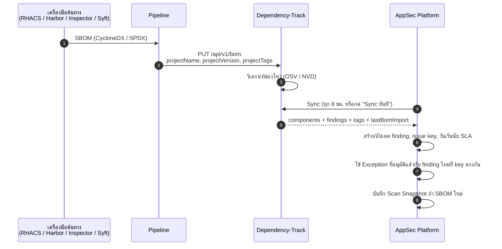
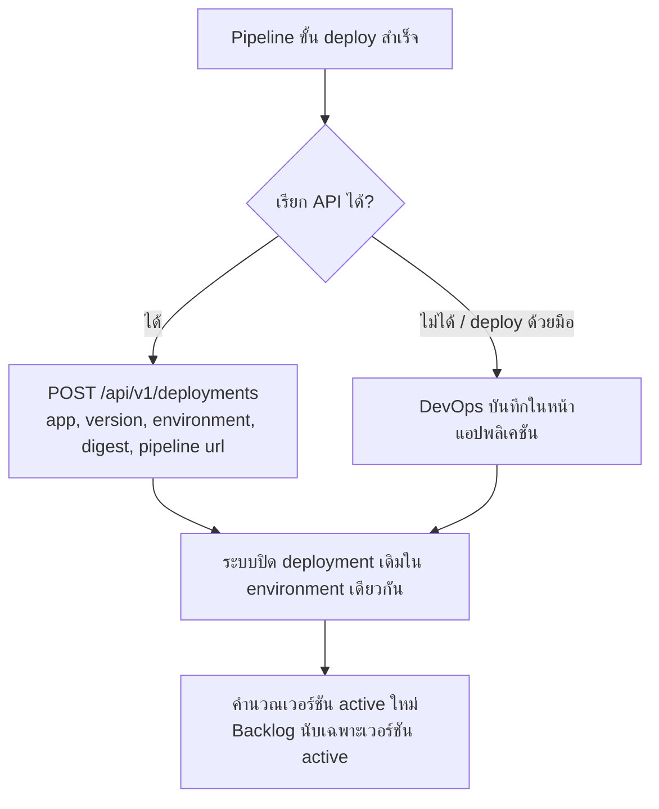
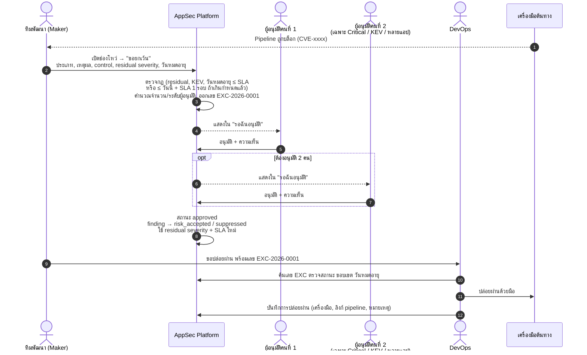
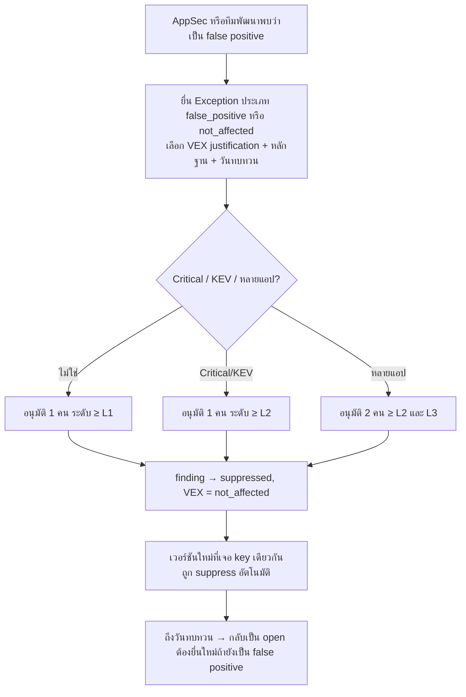
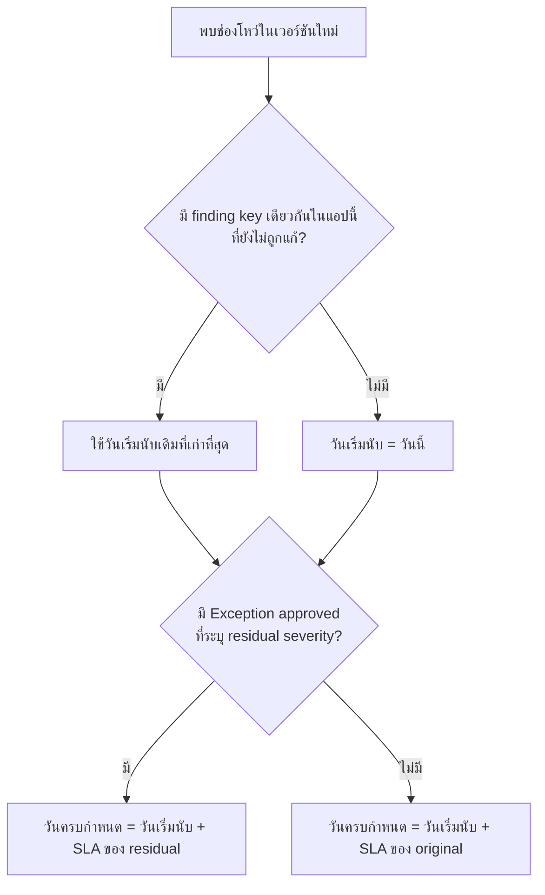
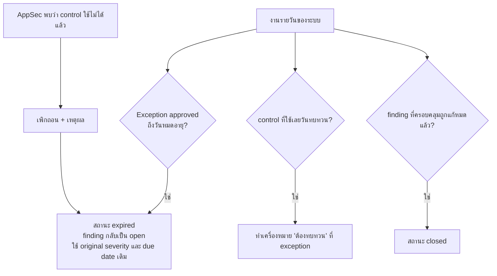
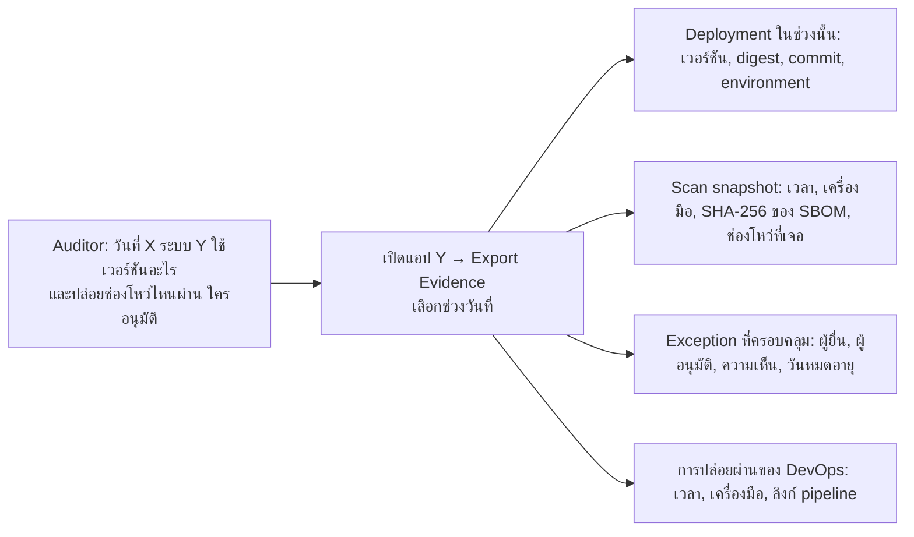

# Workflows — ขั้นตอนการทำงาน

เอกสารนี้อธิบายขั้นตอนการทำงานของแต่ละบทบาท รายละเอียดการออกแบบและเหตุผลอยู่ใน
[risk-exception-design.md](risk-exception-design.md)

## บทบาทที่เกี่ยวข้อง

| บทบาท | ในระบบ | หน้าที่ |
|---|---|---|
| ทีมพัฒนา / Tech Lead | `dev_team` | Maker — ยื่นคำขอยกเว้นสำหรับแอปของทีม, เขียนแผนแก้ไข |
| DevOps | `dev_team` หรือ `appsec` | ตรวจเลข EXC ก่อนปล่อยผ่าน, บันทึกการปล่อยผ่าน, บันทึก deployment |
| Pipeline | `pipeline` (บัญชีเครื่อง) | ส่ง SBOM เข้า DT, บันทึก deployment ผ่าน API |
| AppSec analyst | `appsec` + ระดับ `l1` | Checker ระดับต้น, Maker ได้, จัดการ Control Library |
| AppSec lead | `appsec` + ระดับ `l2` | Checker ระดับ High/Critical |
| CISO / ผู้บริหารความเสี่ยง | `management` หรือ `appsec` + ระดับ `l3` | Checker คนที่สองสำหรับ Critical/KEV/หลายแอป |
| Admin | `admin` | จัดการผู้ใช้และระดับการอนุมัติ — **อนุมัติความเสี่ยงไม่ได้** |
| Auditor | `audit` | ดูข้อมูลและ export Evidence Pack |

---

## W1. จากการสแกนถึงระบบ (ทุกเครื่องมือ)



**สิ่งที่ pipeline ต้องส่ง** (ตัวอย่างที่ทดสอบกับ DT 4.14 แล้ว):

```bash
BOM_B64=$(base64 < sbom.cdx.json | tr -d '\n')
curl -X PUT "$DT_URL/api/v1/bom" \
  -H "X-Api-Key: $DT_UPLOAD_KEY" -H "Content-Type: application/json" \
  -d @- <<EOF
{
  "projectName": "$APP_NAME",
  "projectVersion": "$APP_VERSION",
  "autoCreate": true,
  "projectTags": [
    {"name": "commit:$GIT_COMMIT"},
    {"name": "digest:$(echo $IMAGE_DIGEST | tr ':' '-')"},
    {"name": "tool:$SCAN_TOOL"},
    {"name": "pipeline:$PIPELINE_RUN_ID"}
  ],
  "bom": "$BOM_B64"
}
EOF
```

- `projectName` ต้องตรงกับชื่อแอปในระบบ (ถ้ายังไม่มี ระบบสร้างให้และตั้งทีมเป็น `Unassigned` รอ AppSec ยืนยัน)
- `projectVersion` ใช้เวอร์ชัน release ไม่ใช่ `latest`

---

## W2. บันทึก Deployment (เวอร์ชันที่ใช้งานจริง)



ตัวอย่างสำหรับ pipeline:

```bash
TOKEN=$(curl -s -X POST "$APPSEC_URL/api/v1/auth/login" \
  -d "username=$PIPELINE_USER&password=$PIPELINE_PASSWORD" | jq -r .access_token)
curl -X POST "$APPSEC_URL/api/v1/deployments" -H "Authorization: Bearer $TOKEN" \
  -H "Content-Type: application/json" \
  -d "{\"application_name\":\"$APP_NAME\",\"version_label\":\"$APP_VERSION\",
       \"environment\":\"production\",\"image_digest\":\"$IMAGE_DIGEST\",
       \"reference_url\":\"$PIPELINE_URL\"}"
```

---

## W3. ถูกบล็อกที่เครื่องมือต้นทาง → ขอยกเว้น → ปล่อยผ่าน



### จุดตรวจของ DevOps ก่อนปล่อยผ่าน

1. สถานะต้องเป็น **approved** เท่านั้น (pending / rejected / expired ห้ามปล่อย)
2. ช่องโหว่ที่ถูกบล็อกต้องอยู่ในขอบเขตของคำขอ (แอปเดียวกัน, CVE / component เดียวกัน)
3. ยังไม่เลยวันหมดอายุ
4. บันทึกการปล่อยผ่านกลับเข้าระบบทุกครั้ง

### ผู้อนุมัติต้องดูอะไร

- เหตุผลและหลักฐานเพียงพอหรือไม่
- control ที่อ้างถึงมีอยู่จริงและยังไม่เลยวันทบทวน
- Residual severity สมเหตุสมผลกับ control
- วันหมดอายุสั้นที่สุดเท่าที่จำเป็น
- ปฏิเสธได้พร้อมเหตุผล — ผู้ยื่นต้องยื่นใหม่

---

## W4. False Positive / Not Affected



VEX justification ที่ใช้ได้ (มาตรฐาน CycloneDX / OpenVEX):
`code_not_present`, `code_not_reachable`, `requires_configuration`, `requires_dependency`,
`requires_environment`, `protected_by_compiler`, `protected_at_runtime`, `protected_at_perimeter`,
`protected_by_mitigating_control`

---

## W5. การคำนวณ SLA



ตัวอย่าง: พบ log4j (Critical, SLA 3 วัน) วันที่ 1 ต.ค. → ครบกำหนด 4 ต.ค.
ยื่นยกเว้นด้วย WAF + ไม่เปิดสู่อินเทอร์เน็ต ประเมิน residual เป็น High (SLA 30 วัน) และอนุมัติวันที่ 3 ต.ค.
→ ครบกำหนดใหม่ 31 ต.ค. (นับจาก 1 ต.ค. ไม่ใช่วันที่อนุมัติ) วันหมดอายุของ exception ต้องไม่เกิน 31 ต.ค.

**ช่องโหว่ที่เกิน SLA แล้ว** ต้องขอยกเว้นเท่านั้น

- แผนการแก้ไขยังบันทึกได้ และตั้งวันแก้เสร็จเป็นวันไหนก็ได้ ใช้แนบประกอบคำขอ แต่แผนไม่เปลี่ยนวันครบกำหนดหรือสถานะเกินกำหนด และไม่ปลดการบล็อก Go-Live
- หน้าช่องโหว่ขึ้นคำเตือนให้ไปยื่นขอยกเว้น
- วันหมดอายุของ exception ตั้งได้ไม่เกิน วันนี้ + SLA 1 รอบของ Residual Severity
  ตัวอย่าง: log4j เกินกำหนดมา 57 วัน ขอ residual High (SLA 30 วัน) วันที่ 28 ก.ย. → หมดอายุได้ไม่เกิน 28 ต.ค.
- ถ้าแผนแก้เสร็จช้ากว่าวันหมดอายุของ exception ต้องยื่นต่ออายุก่อนหมด ไม่เช่นนั้นช่องโหว่กลับเป็นเกินกำหนดทันที

---

## W6. หมดอายุ / เพิกถอน / ปิด



---

## W7. ตอบ Audit: เวอร์ชันที่ใช้งานกับผลสแกน



---

## RACI สรุป

| กิจกรรม | ทีมพัฒนา | DevOps | Pipeline | AppSec L1 | AppSec L2 | CISO L3 | Admin | Audit |
|---|---|---|---|---|---|---|---|---|
| ส่ง SBOM เข้า DT | I | A | R | I | | | | |
| บันทึก deployment | | R/A | R | I | | | | I |
| ยื่นคำขอยกเว้น | R | | | R | C | | | |
| อนุมัติ Low/Medium | I | | | R/A | | | | I |
| อนุมัติ High | I | | | C | R/A | | | I |
| อนุมัติ Critical/KEV/หลายแอป | I | | | C | R | R/A | | I |
| ปล่อยผ่านที่เครื่องมือต้นทาง | I | R/A | | I | | | | I |
| จัดการ Control Library | | | | R | A | I | | I |
| กำหนดระดับผู้อนุมัติ | | | | | C | A | R | I |
| Export Evidence | | | | R | | | | R |

R = ลงมือทำ, A = รับผิดชอบผลลัพธ์, C = ให้คำปรึกษา, I = รับทราบ
